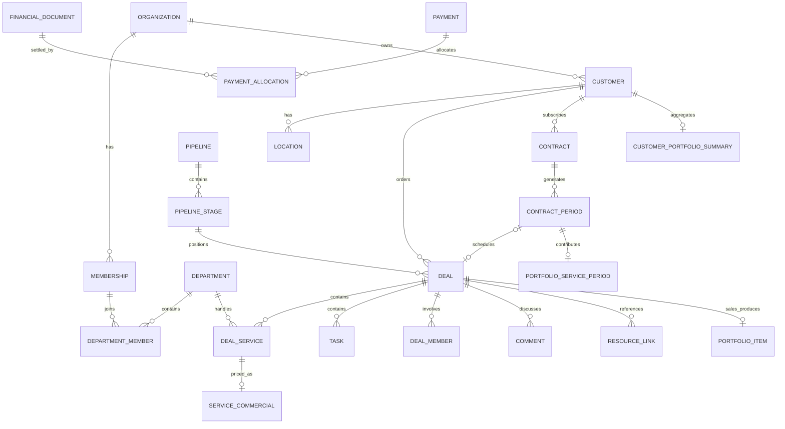

# Məlumat modeli və icazələr

Versiya: 1.0 · 08.09.2026 · Konseptual schema və invariantlar; icra olunan migration deyil.

## Məlumat əlaqələri

UUID təkbaşına hüquq deyil. Nullable əlaqələr lead-in naməlum müəssisəsi, müqaviləsiz sifariş və sifarişsiz xərc üçündür. To Do-nun task/deal_service əlaqəsi məcburidir, sərbəst şəxsi tapşırıq yoxdur.

| Modul | Cədvəl ailəsi | Əsas qayda |
| --- | --- | --- |
| Tenant/Auth | organizations, memberships, invitations, join_requests | organization + user unikal; active/pending/suspended |
| İcazə | roles, role_permissions, member_permission_overrides, department_members | sistem admini ayrıca; bir neçə departament mümkündür |
| Profil | member_profiles, skills, member_skills | agentlik profili; fəaliyyət source hüququndan |
| Müəssisə | customers, contacts, customer_locations | Excel mənbə ID-si, filial, ünvan/koordinat/status |
| Kataloq | service_catalog, service_catalog_commercials | admin idarəsi, qiymət ayrı qorunur |
| Qıf | pipelines, pipeline_stages, loss_reasons | sabit semantic_code, editable label/color; tenant/qıf əlaqəsi |
| Qutu | deals, deal_members | creator, accountable, creation_source, source_deal, contract_period, deadline, version |
| İş | deal_services, deal_service_commercials | department, assignee, status, due_at; line_amount ayrı |
| Alt tapşırıq | tasks | deal_id NOT NULL, deal_service_id optional; qiymət sayılan ikinci xidmət deyil |
| Kommunikasiya | deal_comments, comment_mentions, notifications | mənbə qutu hüququ; recipient/event dedupe |
| Chat | conversations, conversation_members, messages, message_edits | yalnız söhbət iştirakçıları; admin bypass yoxdur |
| Audit | audit_events, outbox_events | trusted actor/source, version, visibility class; client audit yazmır |
| Alətlər | tools, tool_units, tool_reservations, tool_checkouts | interval/capacity, actual return və nasazlıq |
| Maliyyə | financial_documents, financial_lines, payments, payment_allocations, financial_accounts | charge/credit/adjustment, reversal/reference; pul və öhdəlik ayrı |
| Müqavilə | service_contracts, contract_revisions, contract_periods | billing_day, active range, proration_policy=none, period snapshot |
| Aylıq şablon | contract_service_templates, contract_task_templates | versiya, nisbi tarix qaydası, assignee, qiymət snapshot-u |
| Portfel | portfolio_items, customer_portfolio_summaries, portfolio_service_periods | sales deal unique; monthly customer aggregate və period unique |
| Linklər | resource_links | deal/customer/contract, provider, HTTPS URL, author/category |
| Görüş | meetings, meeting_participants | author, start/end, customer/deal, location/link |
| Import/inteqrasiya | import_jobs, import_rows, integration_connections, webhook_endpoints, webhook_events | mənbə/dedupe, private raw payload |
| Fon işləri | job_runs | lease, attempts, run_after, failed/result, dedupe key |

## Tenant, rol və obyekt icazələri

Biznes cədvəllərində organization_id NOT NULL. Əlaqələr composite FK ilə eyni tenantı tələb edir: (organization_id, referenced_id). Müştəri–müqavilə–dövr–qutu və task–service–deal əlaqələrinin də semantik uyğunluğu yoxlanır. Bir tenantdan digərinə adi UPDATE yoxdur.

Üzvlük hər sorğuda trusted DB-dən yoxlanır; user-editable metadata rol mənbəyi deyil. Bir istifadəçinin bir neçə tenant üzvlüyü ola bilər. Active tenant seçimi əlavə hüquq vermir. Fərdi allow/deny rol şablonunu əvəz edir, inherit rola baxır; tenant və obyekt invariantı permission ilə keçilmir. Sistem admin səlahiyyəti rolun adından asılı deyil və son admin silinmir.

CRM read = aktiv tenant üzvlüyü AND (admin OR yaradan OR cari ümumi cavabdeh OR uyğun departament OR qüvvədə olan qutu/iş təyinatı). Departament uyğunluğu aktiv iş sətirlərinin departamentlərindən gəlir; işsiz webhook lead üçün intake_department_id müvəqqəti yönləndirmədir. Qutuya əlavə giriş bütöv departamenti açmır.

Task read = aktiv tenant üzvlüyü AND (admin OR öz işinə təyinat OR iştirak etdiyi qutunun işi). Departamentdəki bütün qutuları görmək onların bütün task detallarını açmır. Yaradan və cari ümumi cavabdeh qutu iştirakçılığına da daxildir; iş təyinatı və əl ilə iştirak ayrıca giriş əsaslarıdır. Qutu iştirakının mənbələri ayrı saxlanır: bir təyinat silinəndə yaradan, cari cavabdeh, əl ilə iştirak və digər iş təyinatlarından qüvvədə olan əsaslar qalır. Qarşılıqlı giriş eyni tenant daxilindədir.

| Əməliyyat | Hüquq |
| --- | --- |
| Qutu yaratma | active member; manual form məcburiyyətləri ilə |
| Qutu dəyişmə / stage / cavabdeh | admin OR immutable creator OR cari ümumi accountable |
| İş/alt tapşırıq yaratma və təyinat | parent qutu redaktoru; başqa tenant/passiv assignee olmaz |
| Öz iş statusu | həmin işin cari assignee-si; əlavə field-lər whitelist-dən kənardır |
| Qiymət oxuma | icazəli qutu + commercials.read; ilkin əməkdaş default-u açıq |
| Qiymət yazma | admin OR (qutu creator/accountable AND commercials.write) |
| Balans oxuma | finance.read; qeyri-admin default bağlı, veriləndə tenant üzrə |
| Tək sifariş ödəniş yazma/düzəliş | admin OR bağlı qutunun creator-u; finance.read tələb deyil |
| Çox sifariş bölgüsü, avans, refund | yalnız admin |
| Sifarişsiz xərc/başlanğıc qalıq | yalnız admin |
| Müəssisə bazasını oxuma | bütün active tenant üzvləri |
| Müəssisə import/düzəliş/pin | yalnız admin; yeni müəssisə importdan |
| Müqavilə/kataloq/rol idarəsi | admin |
| Tools istifadə | öz rezervasiya/götürmə/qaytarma; admin hamısı |
| Görüş yazma | active member yaradır; creator/admin dəyişir, iştirakçılar tenant daxilində |
| Chat məzmunu | conversation membership; admin səlahiyyəti təkbaşına kifayət deyil |
| Export | uyğun module.export AND source read AND field permission |
| Audit | source read + visibility class; financial/chat payload ayrıca |
| Portfolio/Drive/Overview | source qeydlərin read hüququndan hesablanır |

Yaradanın finance.read bağlıykən öz qutusundakı dar payment read/write hüququ bütün tenant cəmlərini və başqasının ödənişini açmır. Qiymət görünmə hüququ ayrıca saxlanır. Multi-allocation payment qeydi başqa qutuya da bağlandıqda creator-un əvvəlki tək-qutu redaktəsi ilə bütöv payment dəyişdirilə bilməz.

## CRM və vaxt invariantları

1. Əl ilə yaradan və ilkin ümumi cavabdeh server session-dan seçilir; created_by sonradan editable deyil. Webhook/recurring-də insan yaradıcı uydurulmur. Webhook ilk owner aktiv default admin, recurring üçün yaradan hüquqları cari tenant adminindədir.
2. Hər mutation expected_version ilə yazılır; köhnə versiya konflikt verir. Təyinat hüququ payload-dakı yeni owner-dən deyil, mövcud sətirdən yoxlanır.
3. Serial tenant/il üzrə atomik ayrılır; tam seriya unikaldır. Display title bundan ayrıdır.
4. Pipeline və stage eyni tenant/qıfa aiddir. Satış və dövri qutu adi drag ilə başqa qıfa keçirilmir.
5. Mərhələ/audit/outbox bir tranzaksiyadır. Birbaşa son mərhələ yazması təsdiq üçün müştəri, iş, assignee, qiymət və datetime məcburiyyətini keçmir. Əvvəl təsdiqlənmiş qutu geri mərhələdə həmin məcburi məlumatı itirmir.
6. Ümumi qiymət yalnız aktiv xidmət sətirlərinin line_amount cəmidir. Heç bir iş/NULL qiymət naməlum totaldır. Manual total/endirim yoxdur, mənfi iş qiyməti olmaz. Valyuta v1-də AZN-dir.
7. İş qiyməti və xidmətin arxivlənməsi total, qutu version-u və lazım olan financial adjustment ilə atomik uyğunlaşdırılır; stale total ilə təsdiq edilmir. Məbləğə təsir edən yeni xidmət, arxivləmə və bərpa da commercials.write/qiymət redaktoru yoxlamasından keçir; sadəcə ümumi qutu redaktəsi ilə qiymət hüququ keçilmir.
8. Tarixlər timestamptz/UTC, timezone agentlikdədir. Billing day/yalnız gün dəyərləri date/int kimi ayrıca saxlanır. İş due_at parent deadline-ından gec ola bilməz. Parent qısaltma/child uzatma paralel tranzaksiyalarda eyni parent lock/version-u koordinasiya edir.
9. Satış delivered açıq işləri tamamlamır/gizlətmir. Dövri həqiqi recurring_done açıq iş/alt task varsa trimmed nonempty səbəb tələb edir. Keçid səbəbi, açıq ID snapshot-u və audit atomikdir. Sonradan own status edit mümkündür.
10. Lost üçün tenant-a aid active reason tələb olunur. Yenidən açılma səbəbi məcburidir; tarixçə qalır. Heç biri pul yazmır/silmir.
11. To Do ayrıca status/təyinat cədvəli deyil. Reassignment eyni iş ID-sini yeni şəxsin filtrinə keçirir; ümumi accountable bütün alt işlərin assignee-si sayılmır.

## Aylıq dövr və ödəniş görünüşü

Dövr ilkin seçilmiş ödəniş tarixindən başlayır, faktiki pul tarixindən deyil. billing_day 1–31 ayrıca saxlanır: hər hədəf ayda min(billing_day, həmin ayın gün sayı). Fevral uyğunlaşdırması mart üçün anchor-u dəyişmir. period_start daxil, period_end xaric sərhəddir; initial deadline period_end-dən əvvəlki yerli gün 23:59.

contract_period üçün (tenant, contract, period_start), recurring deal üçün (tenant, contract_period) unikaldır. İş mənbə açarı (tenant, period, template_item) olur. Period snapshot/revision seçiləndən sonra retry onu başqa versiya ilə qarışdırmır. İşsiz/passiv assignee/invalid tarix generation-u xəta kimi saxlayır və bərpa olunur. Keçmiş ayı yeni ay üçün overwrite etmə.

Müqavilənin effective revision tarixçəsi generatora dövrün başlanğıcında qüvvədə olan status/şablonu verir. Pause/stop sonrakı dövrləri dayandırır; cari mövcud qutu/task qalır. Yaranmamış gələcək aylar qabaqcadan borclandırılmır. Resume növbəti billing_day-dan, boşluq üzrə catch-up yoxdur. Dayandırılmadan əvvəl başlamış amma worker gecikməsinə görə yaranmamış dövr tarixi active intervala əsasən bir dəfə bərpa edilir; gələcək paused dövrü yaratmaq olmaz.

proration_policy=none: başlamış dövrün charge-ı stop ilə dəyişmir; explicit admin adjustment ayrıca hadisədir. Sonradan siyasət dəyişməsi keçmiş payment/document tarixçəsini yenidən yazmır.

Recurring stage_id üç icra halını saxlayır; display_stage_code/payment_alert server nəticəsidir. Gecikmə yerli payment_due_date sonundan sonra hesablanır. C = dövrün düzəlişlərdən sonrakı xalis alacağı, P = həmin dövrə ayrılmış xalis valid pul. C>0 və overdue və 2*P<C olduqda display=recurring_unpaid, qalan halda current work stage. C=0 üçün payment_required=false. NULL C hazır dövr deyil, sıfır sayılmır.

1 000,01 AZN charge üçün 500,00 AZN kifayət deyil, 500,01 kifayətdir. Faiz display rounding-i ilə hesablanmır. Müştərinin başqa ay pulu və ayrılmamış avansı P-yə daxil deyil. Work stage ödəniş gözlənərkən dəyişə bilər; hədd tamamlananda cari stage-ə dönür, köhnə snapshot-a reset olmur. Sütun dəyişikliyi payment/charge/completion/Portfolio hadisəsini təkrarlamır.

## Maliyyə invariantları

Pul numeric(15,2) və ya qəpiklə, binary float olmadan saxlanır. Öhdəlik, faktiki pul və allocation fərqli qeydlərdir. Birinci charge üçün tenant/source_kind/source_id/charge_kind unique; source bir dəfəlik iş qrupu/qutu və ya contract_period-dir. Hadisə ID-sinin fərqli olması ikinci ilkin charge yaratmağa icazə deyil. Qarışıq aylıq/birdəfəlik satışda hər xidmət mənbə qrupu bir dəfə sayılır.

Maliyyə sənədi issued olduqdan sonra silinmir/overwrite edilmir. Düzəliş ayrıca linked document/line, reason, actor və source_revision ilədir. İş qiymətinin sonrakı fərqi bir dəfə hesablanır; refund ödənişi və kommersiya total-ı eyni anlayış deyil. Order cancellation adjustment ümumi endirim sahəsi yaratmır.

Allocation yalnız eyni tenant/customer/currency sənədlərinədir; payment xalis məbləğini və öhdəliyin açıq qalıq tutumunu keçmir. Paralel allocation və reversal payment/document row-larını sabit sıra ilə lock edir. Artıq məbləğ unallocated credit-dir, səssiz başqa aya bölünmür.

Creator öz qutusuna aid bir payment-i daxil/düzəldə bilər; multi-order bölgü/unallocated customer credit/refund adminə aiddir. Creator düzəlişi allocation sərhədlərini pozursa yazma rədd edilir və admin adjustment tələb olunur; digər qutu məbləği error-da ifşa olunmur. Adi overall accountable commercials.write hüququ ilə payment allocation dəyişdirə bilməz.

Qiymət azalması xalis alacağı artıq ayrılmış ödənişdən aşağı salırsa yalnız adminin bir tranzaksiyalı commercial + financial reconciliation əməliyyatı artıq allocation-u eyni müştərinin avansına qaytarır. Pul geri getmiş sayılmır; faktiki refund ayrıca qeyddir. Ödəniş düzəlişi/reversal, bölgü və törəmə payment_alert eyni canonical məbləğlərdən hesablanır.

Başlanğıc qalıqlar ayrıca source_kind/as_of_date ilədir; ilk dəfə satış/pul metric-i deyil. Account balansı opening + real inflow − real outflow-dur; verilmiş öhdəlik pul deyil. Freelancer/təchizatçı/əməkdaş/ofis borcları bu ümumi modelə tabedir.

## Portfel, resurs, import və chat invariantları

Satış portfolio_items üçün (tenant, deal) unique. Draft/completed/archive statusu sales mərhələsinə uyğun dəyişir, tarixçə qalır. Aylıq customer summary üçün (tenant, customer), contribution üçün (tenant, contract_period) unique. Müddət Bitdi mənbə intervallarının müqavilənin faktiki xidmət göstərilən günləri ilə kəsişməsinin birləşməsidir; future dates current as-of ilə kəsilir. Stop/pause/end əməliyyatı ayrıca service_last_day saxlayır (ilkin dəyər əməliyyatın yerli günü, admin səbəblə dəqiqləşdirir); bu sərhəddən sonrakı günlər sayılmır. Billing period, charge və deadline bu sahə ilə avtomatik dəyişmir. Pause boşluğu və üst-üstə düşən günlər şişirtmir. Reopen contribution-u inaktiv edir, re-done eyni contribution-u bərpa edir; payment display dönüşü onu dəyişmir.

Portfolio/Overview aggregate-ləri oxuyanın icazəli source qeydlərindən hesablanır; tenant üzrə bütün snapshot-u əməkdaşa vermə. Bitdi reason/financial audit məxfi sahə filtrindən keçir.

Tool reservation üçün [start,end) intervalı, aktiv capacity üzrə atomik yoxlama; physical checkout qaytarılana qədər vahid occupied qalır. Nasaz/inactive vahid yeni rezervasiya qəbul etmir. İcazəsiz member başqasının checkout-unu düzəltmir.

Import faylı/job tenant/private-dir; tətbiq olunan source ID-lər unikaldır. Preview əsas baza dəyişməsi deyil. Təkrar job sətirləri təkrar yaratmır, rollback sonrakı insan dəyişikliklərini kor-koranə silmir. Tenant/source reconciliation, phone string, filial və manual pin üstünlüyü saxlanır. Yeni customer yalnız qorunan import axınındandır.

Chat membership məzmun oxuma/yazma sərhədidir. Mesajı verən actor session-dandır; body ilə müəllif saxtalaşdırılmır. Yeni qrup iştirakçısı v1-də qoşulduğu vaxtdan sonrakı mesajları görür; removed member yeni fetch/abunə almır. Redaktə 15 dəqiqə pəncərəsi server vaxtı ilə, tombstone və private edit tarixçəsi ilədir. Chat auditini ümumi tenant audit ekranında məzmunla göstərmə.

## RLS, secretlər və Realtime

Bütün Data API cədvəllərində RLS və minimum grants; schema exposure, view və RPC bypass testləri. Normal əməliyyat SECURITY INVOKER; definer tələb olunarsa private schema, sabit search_path, revoked public execute, explicit auth/tenant/object checks. Secret/service_role brauzerə/loga/repoya çıxmır. Qiymət və payment məlumatı ayrıca qorunan relation-da saxlanır; sütunu UI-də gizlətmək kifayət deyil.

Keş tenant/member/permission epoch/source ilə bağlıdır. Private topic auth tək topic adındakı tenant ID-sinə etibar etmir. Realtime geniş kanala qiymət/payment/chat body ötürmür; minimal dəyişiklikdən sonra current RLS ilə fetch edilir. İcazə ləğvi növbəti server sorğusundan qüvvədədir, client məlumatı təmizləyir. Vaxtı məhdud signed URL artıq endirilmiş məzmunu geri almır; export endirməsi serverdə təkrar icazə yoxlaması və qısa link ömrü ilə qurulur.

## İndeks və sınaq namizədləri

Tenant+pipeline+stage+rank/id, deal service tenant+department/deal, task tenant+assignee+status+due_at, membership/deal_member əlaqələri, customer source ID/normalized contact, notification recipient/read/time, period contract/start, finance source və allocation parent ID-ləri, audit entity/time, job status/run_after. PostGIS yalnız real spatial sorğu ehtiyacı varsa; ilkin bbox indeksləri və WGS84 validation kifayətdir.

Göstərilmiş indekslər ölçülüb EXPLAIN ilə əsaslandırılır. RLS predicate-ləri üzvlük/department açarları ilə indekslənir; ümumi SELECT-dən sonra JS-də tenant filtri tətbiq edilmir.
